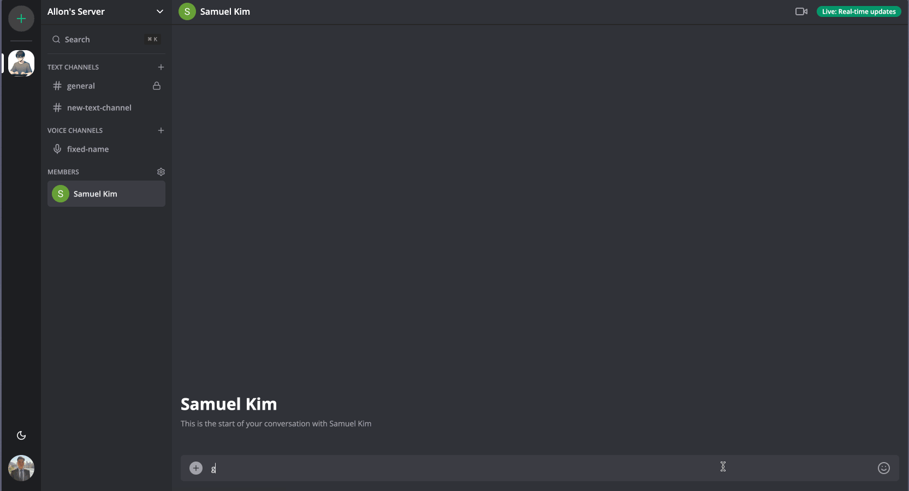
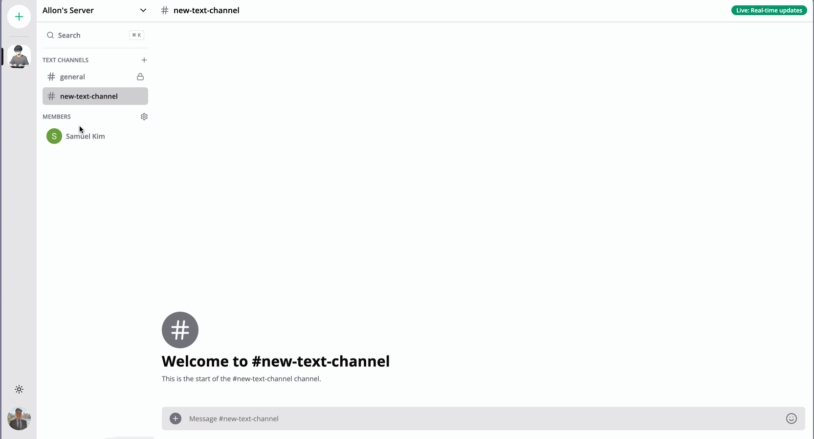
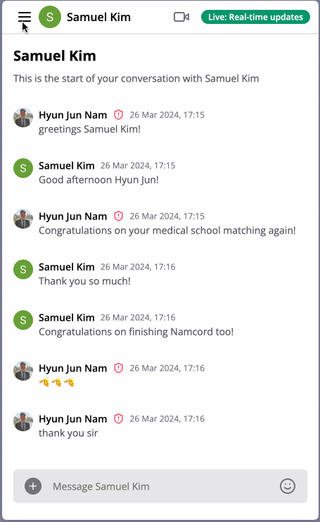

# Namcord

[LIVE](namcord-production.up.railway.app)

## Overview
Namcord is a fullstack clone of Discord that enables real-time voice, video, and text communication among friends and communities, ideal for gamers and various interest groups.

## Key Features

### Message Members
You can message in channels and directly message members in real time, as well as send attachments and emojis.

### Create Channels
You can create new channels, whether they be text, audio, or video; Namcord has you covered! Did I also mention that you can switch your layout to light mode?

### Video Room
If you want to chat face-to-face with your friend, you can also do that in Namcord!

### Responsive Design
Namcord can also be rendered cleanly and optimized for smaller devices, such as phones and tablets.

## Technologies
+ Languages: TypeScript, HTML/CSS
+ Frameworks: React, Next.js 14
+ Runtime: Node.js
+ Databases: MySQL
+ API: Clerk.IO, UploadThing, LiveKit
+ Library: Socket.IO, TailwindCSS, Prisma (ORM), Shadcn UI

## Future Prospects
+ Real time rendering for channel deletion.
+ Editing profile name.